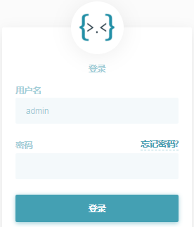
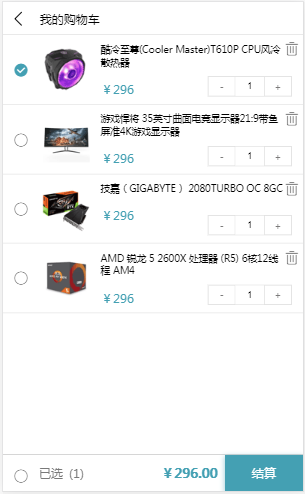

# 1 介绍

## 1.1 课程目标

- [ ] 了解项目基本开发流程
- [ ] 了解前后端分离项目架构
- [ ] 了解具体业务逻辑
- [ ] 了解接口文档的作用及规范
- [ ] 熟练运用之前所讲部份知识点
- [ ] 熟悉JWT跨域认证方案

## 1.2 时间安排

| 功能                   | 讲解/开发时间 | 时长   |
| ---------------------- | ------------- | ------ |
| 项目整体介绍及开发流程 | 9:00--9:40    | 40分钟 |
| 配置接口服务地址       | 9:40--9:50    | 10分钟 |
| 休息                   | 9:50--10:00   |        |
| 会员注册               | 10:00--10:30  | 30分钟 |
| 会员登录               | 10:30--11:00  | 30分钟 |
| 休息                   | 11:00--11:10  |        |
| 商品列表               | 11:10--12:00  | 50分钟 |
| 休息                   | 12:00--14:00  |        |
| 查看商品               | 14:00--14:30  | 30分钟 |
| 添加购物               | 14:30--15:00  | 30分钟 |
| 休息                   | 15:00--15:10  |        |
| 查看购物               | 15:10--15:50  | 40分钟 |
| 休息                   | 15:50--16:00  |        |
| 删除购物               | 16:00--16:30  | 30分钟 |
| 修改购物               | 16:30--17:00  | 30分钟 |
| 总结及分享             | 18:00--19:00  | 60分钟 |

# 2 项目开发流程

## 2.1 传统的项目开发流程

## 2.2 前后端分离项目开发流程

## 2.3 前后端分离项目架构图

# 3 接口列表

## 3.1 会员注册

接口功能：接收用户名和密码，完成用户的注册操作

请求地址：http://www.shop.com/api/member/register

请求方式：post

参数列表

| 参数     | 数据类型 | 是否必须 | 说明           |
| -------- | -------- | -------- | -------------- |
| username | 字符串   | 是       | 用户名，长度20 |
| password | 字符串   | 是       | 密码，长度20   |
| email    | 字符串   | 是       | 邮箱，长度30   |

返回结果

| 属性 | 数据类型 | 说明                        |
| ---- | -------- | --------------------------- |
| code | 数值     | 状态码：2000 成功 4000 失败 |
| msg  | 字符串   | 是否注册成功相关信息        |

示例：

~~~javascript
{
    "code":2000,
    "msg":"操作成功"
}
~~~

## 3.2 会员登录

接口功能：接收用户名和密码，查询该会员是否已经注册，完成登录功能，返回token

请求地址：http://www.shop.com/api/member/login

请求方式：post

参数列表

| 参数     | 数据类型 | 是否必须 | 说明           |
| -------- | -------- | -------- | -------------- |
| username | 字符串   | 是       | 用户名，长度20 |
| password | 字符串   | 是       | 密码，长度20   |

返回结果

| 属性  | 数据类型 | 说明                        |
| ----- | -------- | --------------------------- |
| code  | 数值     | 状态码：2000 成功 4000 失败 |
| msg   | 字符串   | 是否登录成功相关信息        |
| token | 字符串   | 令牌，其中包含用户身份      |

示例：

~~~javascript
{
    "code":2000,
    "msg":"操作成功",
    "token":"xxxxxxxxxxxxxxxx.yyyyyyyyyyyyyyy.zzzzzzzzzzzzzzzz"
}
~~~

## 3.3 查看商品列表

接口功能：查看所有商品信息，并同时支持分页与搜索功能

请求地址：http://www.shop.com/api/goods/getlist

请求方式：get

参数列表

| 参数   | 数据类型 | 是否必须 | 说明             |
| ------ | -------- | -------- | ---------------- |
| page   | 数值     | 否       | 页码     默认：1 |
| search | 字符串   | 否       | 搜索关键字       |

返回结果

| 属性 | 数据类型 | 说明                        |
| ---- | -------- | --------------------------- |
| code | 数值     | 状态码：2000 成功 4000 失败 |
| msg  | 字符串   | 是否查询成功相关信息        |
| page | 对象     | 分页信息                    |
| data | 对象     | 商品数据                    |

示例：

~~~javascript
{
    "code":2000,
    "msg":"查询成功",
    "page": {
        "pageCount": 3, 
        "pageNo": 1, 
        "pageSize": 4, 
        "total": 12
    },
    "data":[
        {
            "id":3,
            "name":"李宁青少年男女足球鞋碎钉儿童训练鞋学生人造草地ASTK029",
            "price":"199",
            "fileurl":"\/uploads\/1.jpg",
            "content":"李宁碎钉足球训练鞋，采用简洁的色彩搭配，简单时尚。 "
        },
        {
            "id":4,
            "name":"花花公子男装短袖T恤男夏季新款修身圆领打底衫半袖衣服潮流体恤",
            "price":"168",
            "fileurl":"\/uploads\/2.jpg",
            "content":"品牌: PLAYBOY\/花花公子货号: RT191919基础风格: 青春流行上市年份季节"
        }
    ]
}
~~~

## 3.4 商品详细信息

接口功能：查看当前商品信息

请求地址：http://www.shop.com/api/goods/getinfo

请求方式：get

参数列表：

| 参数 | 数据类型 | 是否必须 | 说明   |
| ---- | -------- | -------- | ------ |
| id   | 数值     | 是       | 商品ID |

返回结果

| 属性 | 数据类型 | 说明                        |
| ---- | -------- | --------------------------- |
| code | 数值     | 状态码：2000 成功 4000 失败 |
| msg  | 字符串   | 是否查询成功相关信息        |
| data | 对象     | 商品数据                    |

示例

~~~javascript
{
    "code": 2000,
    "msg": "操作成功",
    "data": {
        "id": 4,
        "name": "花花公子男装短袖T恤男夏季新款修身圆领打底衫半袖衣服潮流体恤",
        "price": "168",
        "fileurl": "/uploads/2.jpg",
        "content": "品牌: PLAYBOY/花花公子货号: RT191919基础风格: 青春流行上市年份季节: 2019年"
    }
}
~~~

## 3.5 添加购物车

接口功能：将当前选中商品添加至购物车

请求地址：http://www.shop.com/api/cart/add

请求方式：get

参数列表：

| 参数  | 数据类型 | 是否必须 | 说明     |
| ----- | -------- | -------- | -------- |
| gid   | 数值     | 是       | 商品ID   |
| price | 数值     | 是       | 商品单价 |
| token | 字符串   | 是       | 令牌     |

返回结果

| 属性 | 数据类型 | 说明                        |
| ---- | -------- | --------------------------- |
| code | 数值     | 状态码：2000 成功 4000 失败 |
| msg  | 字符串   | 是否添加成功相关信息        |

示例

~~~javascript
{
    "code": 2000,
    "msg": "添加成功",
}
~~~

## 3.6 查看购物车

接口功能：查看当前会员购物车中的所有商品

请求地址：http://www.shop.com/api/cart/getlist

请求方式：get

参数列表

| 参数  | 数据类型 | 是否必须 | 说明 |
| ----- | -------- | -------- | ---- |
| token | 字符串   | 是       | 令牌 |

返回结果

| 属性 | 数据类型 | 说明                        |
| ---- | -------- | --------------------------- |
| code | 数值     | 状态码：2000 成功 4000 失败 |
| msg  | 字符串   | 是否查询成功相关信息        |
| data | 对象     | 商品数据                    |

示例

~~~javascript
{
    "code":2000,
    "msg":"共有2条数据",
    "data":[
        {
            "id":174,
            "name":"PURE＆MILD\/泊美鲜纯珍萃柔亮保湿面霜滋润",
            "price":"100",
            "fileurl":"\/uploads\/3.jpg",
            "num":1
        },
        {
            "id":175,
            "name":"花花公子男装短袖T恤男夏季新款修身圆领打底衫半袖衣服潮流体恤",
            "price":"100",
            "fileurl":"\/uploads\/2.jpg",
            "num":1
         }
    ]
}
~~~

## 3.7 删除购物车

接口功能：删除当前会员购物车中的对应商品

请求地址：http://www.shop.com/api/cart/remove

请求方式：get

参数列表

| 参数  | 数据类型 | 是否必须 | 说明   |
| ----- | -------- | -------- | ------ |
| id    | 数值     | 是       | 数据ID |
| token | 字符串   | 是       | 令牌   |

返回结果

| 属性 | 数据类型 | 说明                        |
| ---- | -------- | --------------------------- |
| code | 数值     | 状态码：2000 成功 4000 失败 |
| msg  | 字符串   | 是否删除成功相关信息        |

示例

~~~javascript
{
    "code": 2000,
    "msg": "删除成功",
}
~~~

## 3.8 修改购物车

接口功能：修改购物车中对应商品的数量

请求地址：http://www.shop.com/api/cart/edit

请求方式：get

参数列表 

| 参数  | 数据类型 | 是否必须 | 说明     |
| ----- | -------- | -------- | -------- |
| token | 字符串   | 是       | 令牌     |
| id    | 数值     | 是       | 数据ID   |
| num   | 数值     | 是       | 商品数量 |

返回结果

| 属性 | 数据类型 | 说明                        |
| ---- | -------- | --------------------------- |
| code | 数值     | 状态码：2000 成功 4000 失败 |
| msg  | 字符串   | 是否修改成功相关信息        |

示例

~~~javascript
{
    "code": 2000,
    "msg": "修改成功"
}
~~~

# 4 准备工作

## 4.1 了解其它返回状态

~~~javascript
{"code":2000 , "msg":'操作成功'}
{"code":4000 , "msg":'操作失败'}

{"code":4101 , "msg":'缺少参数'}
{"code":4102 , "msg":'参数值不能为空'}
{"code":4103 , "msg":'参数值无效'}
{"code":4104 , "msg":'商品ID无效'}
{"code":4105 , "msg":'商品数量无效'}
{"code":4106 , "msg":'页码参数无效'}

{"code":4201 , "msg":'用户名已存在'}
{"code":4202 , "msg":'用户名不存在'}
{"code":4203 , "msg":'密码不正确'}
{"code":4204 , "msg":'登录时间过期，请重新登录'}
{"code":4205 , "msg":'用户信息篡改，请重新登录'}
{"code":4206 , "msg":'用户身份错误，请重新登录'}

{"code":4301 , "msg":'没有数据'}
{"code":4302 , "msg":'购物车中没有任何商品'}
{"code":4303 , "msg":'该商品已添加至您购物车中'}
{"code":4304 , "msg":'购物车中没有该商品'}
~~~

## 4.2 配置接口服务地址

C:\Windows\System32\drivers\etc\hosts

~~~ini
#127.0.0.1    	localhost
192.168.50.200	www.shop.com
~~~

在命令行中，测试域名是否配置成功

~~~bash
ping www.shop.com
~~~

## 4.3 创建公共配置文件

在项目中，创建config.js做为项目的配置文件，用于保存接口服务域名，便于程序的移植

~~~javascript
let domain = 'http://www.shop.com';
~~~

# 5 会员模块

## 5.1 会员注册

要求：输入用户名、密码、邮箱，点击注册按钮将数据发送至服务器进行注册

步骤：

- [ ] 获取用户输入在表单中的数据
- [ ] 对表单数据进行有效性校验（选做，如：邮箱格式，二次密码一致，是否为空，长度合法等）
- [ ] 将数据发送至接口服务进行会员注册
- [ ] 注册成功后跳转至登录页面

## 5.2 会员登录

要求：输入用户名、密码，完成用户登录功能，保存令牌至本地存储

步骤：

- [ ] 获取用户输入在表单中的数据
- [ ] 对表单数据进行有效性校验（选做）
- [ ] 发送数据至接口服务进行用户身份核对
- [ ] 成功后将接口返回的`token`保存至本地存储
- [ ] 跳转页面至商品列表页

# 6 商品模块

## 6.1 商品列表

要求：分页显示的所有商品，并实现搜索功能

步骤：

- [ ] 页面载入后，请求商品信息并渲染至页面中
- [ ] 根据`fileurl`显示商品图片
- [ ] 将`id`绑定至对应标签属性中
- [ ] 根据返回值`page`显示分页信息，点击分页按钮，实现分页功能
- [ ] 用户搜索商品输入内容时，绑定对应事件，将内容发送至接口服务，将返回商品再次渲染至页面中

## 6.2 商品详情

要求：点击商品图片或名称，进入商品详情页显示商品详细信息

步骤：

- [ ] 在商品列表页中，点击图片或商品名称时，获取当前商品`ID`
- [ ] 跳转至商品详情页中，并携带`ID`参数
- [ ] 商品详情页载入后，获取传递的`ID`参数，发送至接口服务
- [ ] 将返回数据渲染至商品详情页

# 7 购物车模块

## 7.1 添加购物车

要求：

点击商品右下方小购物车图标，将对应商品添加至购物车

步骤：

- [ ] 点击购物车小图标时，获取当前商品`ID`
- [ ] 将商品`ID`与`token`发送至对应接口服务
- [ ] 根据返回值显示添加是否成功相关信息

## 7.2 查询购物车

要求：

点击商品页中右下方大购物车图标，跳转至购物车页面，加载当前用户购物车中商品列表并显示

步骤：

- [ ] 点击大购物车图标，跳转至购物车页面
- [ ] 购物车页面载入时，取出`token`，请求对应接口，并传递`token`
- [ ] 接收响应数据，并渲染至购物车页面中

## 7.3 删除购物车

要求：

点击购物车中的删除按钮，删除购物车中的当前商品

步骤：

- [ ] 点击删除按时，获取当前商品`ID`
- [ ] 获取`token`，与商品`ID`发送至接口服务
- [ ] 如果删除成功，则重新加载购物车中的商品列表并显示

## 7.4 修改购物车

要求：

点击`+-`符号，完成购买商品数量的修改

步骤：

- [ ] 点击`+-`符号时，获取当前商品`ID`、商品数量
- [ ] 获取`token`，与商品`ID`以及数量全部发送至对应接口服务中
- [ ] 如果接口修改数量成功，则回显示至商品数量中

